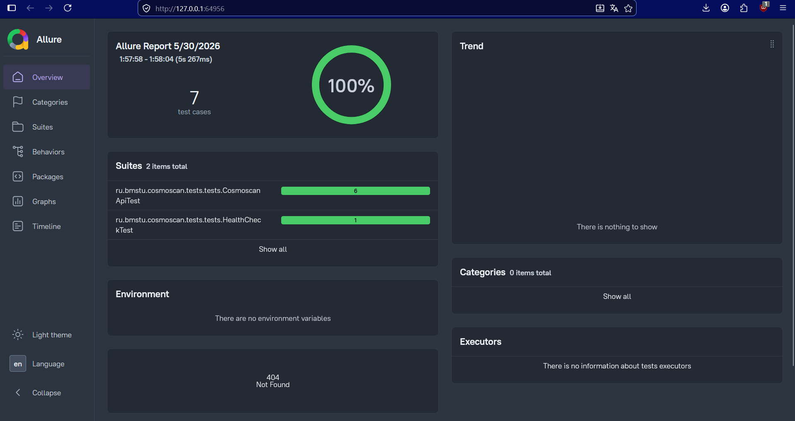

# Cosmoscan Tests

Автоматизированные тесты для API системы **КосмоСкан**.

## Стек

Gradle 8.12, Java 21, JUnit 5, REST Assured 5.5, Allure Report 2.42.

## Перед запуском

1. JDK 21 должен быть в PATH.
2. Allure CLI должен быть установлен глобально

```bash
npm install -g allure-commandline
```

3. Основное приложение должно быть запущено. API Gateway доступен на `http://localhost:8080`:

```bash
cd h4
docker-compose up -d
```

## Запуск тестов

```bash
.\gradlew test
```

Хост по умолчанию `http://localhost:8080`. Для смены хоста: 

```bash
.\gradlew test -Dbase.url=http://192.168.0.105:8080
```

## Allure-отчет

```bash
.\gradlew allureReport   
.\gradlew allureServe
```

### Пример Allure отчета



## Полный цикл

```bash
.\gradlew clean test allureReport
```

## Покрываемые эндпоинты

POST `/api/v1/works` JSON
POST `/api/v1/works` multipart
GET `/api/v1/works/{workId}/status`
GET `/api/v1/works/{workId}/reports`

Плюс пара негативных сценариев: 404 для несуществующего workId, 4xx для невалидного UUID, проверка доступности Gateway.

## Конфигурация

Системные свойства задаются в `build.gradle.kts` в блоке `tasks.withType<Test>`:

`base.url` — базовый URL Gateway, по умолчанию `http://localhost:8080`
`allure.results.directory` — путь к сырым результатам, по умолчанию `build/allure-results`

