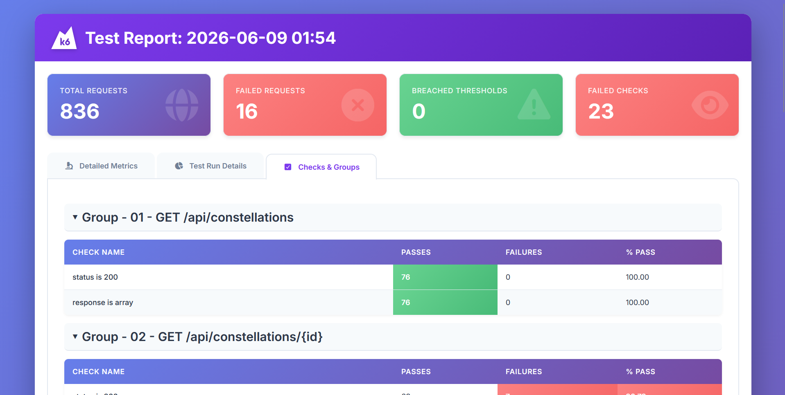

# Система управления спутниковой группировкой

## 1. Общее описание

Backend-система для управления группировками искусственных спутников Земли. Позволяет создавать группировки, добавлять спутники связи и наблюдения, активировать их и выполнять целевые миссии. Реализация на Java 21, Spring Boot, следует принципам SOLID и паттернам GoF.

Три микросервиса:
- **satellite** - REST API управления спутниками и группировками
- **scheduler** - планировщик миссий по cron-расписанию
- **telemetry-service** - эмулятор телеметрии

## 2. Технологии

- Java 21
- Spring Boot 3.2 (Spring MVC, Spring Data JPA, Spring Validation, Spring AOP)
- PostgreSQL 15
- Apache Kafka 3.8
- gRPC + Protobuf
- Liquibase
- Lombok, MapStruct
- SpringDoc OpenAPI
- Feign + Outbox Transactional
- Docker / Docker Compose
- JUnit 5, MockMvc, Testcontainers

## 3. Архитектура

### 3.1. satellite

- `common` - общие утилиты, обработка исключений, CRUD-интерфейсы, AOP
- `constellation` - сущность `Constellation`, репозиторий, сервисы, REST-контроллер
- `satellite` - иерархия `Satellite` -> `CommunicationSatellite` / `ImagingSatellite`, репозиторий, сервисы, контроллер
- `operations` - фасад `SpaceOperationCenterService`, контроллер миссий
- `telemetry` - Kafka-консьюмер телеметрии

### 3.2. scheduler

Планировщик, отправляющий миссии в satellite по cron-расписанию через Feign. Гарантия доставки - паттерн Outbox Transactional.

### 3.3. telemetry-service

Эмулирует телеметрию 5 спутников. Каждые 2 секунды генерирует внутреннюю и внешнюю температуру, отправляет protobuf-сообщения `TelemetryUpdate` в Kafka topic `telemetry`. Дополнительно доступен gRPC Server Streaming на порту 9091.

## 4. Взаимодействие сервисов

```
telemetry-service - Kafka --> satellite
scheduler - Feign/REST -> satellite
```

- **Kafka**: telemetry-service пишет protobuf-сообщения в topic `telemetry`, satellite читает и обновляет спутники в БД
- **Feign**: scheduler отправляет REST-запросы на выполнение миссий в satellite

## 5. Паттерны проектирования

### 5.1. Порождающие

**Factory Method** - `SatelliteFactory` с реализациями для каждого типа спутника.

**Builder** - `Constellation`, `EnergySystem`, DTO.

### 5.2. Структурные

**Facade** - `SpaceOperationCenterService` объединяет операции в высокоуровневый API.

**Decorator** - `@MeasureExecutionTime` + AOP-аспект для замера времени методов.

### 5.3. Поведенческие

**Strategy** - `SatelliteUpdater` с разными стратегиями обновления.

**Template Method** - `Satellite` задает шаблон поведения, подклассы реализуют `performMission()`.

**Outbox Transactional** - гарантированная доставка сообщений из scheduler.

## 6. Принцип инверсии зависимостей

- Сервисы зависят от интерфейсов, не от реализаций
- `SatelliteFactory` внедряется списком - новый тип спутника добавляется без изменения кода
- Репозитории - интерфейсы, реализации предоставляет Spring Data JPA
- Внедрение через конструктор

## 7. Инициализация данных

При старте satellite создаются две группировки (Орбита-1, Орбита-2) с 5 спутниками и выполняется демонстрационный прогон миссий.

## 8. Сборка и запуск

### 8.1. Docker Compose

```bash
docker-compose up -d --build
```

Swagger UI: `http://localhost:8080/swagger-ui.html`

### 8.2. Локальный запуск

Требует PostgreSQL и Kafka на localhost.

```bash
cd satellite && ./gradlew bootRun --args='--spring.profiles.active=local'
cd scheduler && ./gradlew bootRun --args='--spring.profiles.active=local'
cd telemetry-service && ./gradlew bootRun
```

### 8.3. Профили Spring

| Профиль | Назначение |
|---|---|
| `local` | БД и Kafka на localhost |
| `docker` | Адреса во внутренней Docker-сети |
| `test` | Тесты с Testcontainers |

### 8.4. Просмотр сообщений Kafka

```bash
docker exec kafka sh -c "/opt/kafka/bin/kafka-console-consumer.sh --bootstrap-server kafka:9092 --topic telemetry --from-beginning"
```

Сообщения передаются в формате Protobuf, поэтому в консоли отображаются как бинарные данные. В логах satellite они выводятся в читаемом виде:

```
Связь-1 получил телеметрию: внутр. 21.51°C / внеш. -79.83°C
```

### 8.5. Порты

| Сервис | REST | gRPC |
|---|---|---|
| satellite | 8080 | - |
| scheduler | 8081 | - |
| telemetry-service | 9092 | 9091 |
| PostgreSQL | 5432 | - |
| Kafka (внутри сети) | - | 9092 |
| Kafka (localhost) | - | 9094 |

## 9. Тесты

### 9.1. Модульные и интеграционные

```bash
./gradlew test
./gradlew test jacocoTestReport
```

Отчет покрытия: `build/reports/jacoco/test/html/index.html`

### 9.2. Нагрузочное тестирование (k6)

#### Пользовательский сценарий

Тестовый скрипт имитирует работу оператора центра управления полетами, выполняющего полный бизнес-цикл управления спутниковой группировкой:

| Шаг | Метод | Эндпоинт | Действие | Тип |
|-----|-------|----------|----------|-----|
| 1 | GET | `/api/constellations` | Получение списка всех группировок | Чтение |
| 2 | GET | `/api/constellations/1` | Получение данных группировки | Чтение |
| 3 | GET | `/api/constellations/1/status` | Расширенный статус группировки | Чтение |
| 4 | GET | `/api/constellations/1/satellites` | Спутники группировки | Чтение |
| 5 | POST | `/api/constellations` | Создание новой группировки | Запись |
| 6 | POST | `/api/constellations/{id}/satellites` | Добавление спутника связи | Запись |
| 7 | GET | `/api/satellites/{id}` | Данные добавленного спутника | Чтение |
| 8 | POST | `/api/constellations/{id}/activate` | Активация спутников | Изменение |
| 9 | POST | `/api/constellations/{id}/execute` | Запуск миссий | Изменение |
| 10 | DELETE | `/api/constellations/{id}` | Удаление тестовой группировки | Удаление |

Сценарий комбинированный: 5 операций чтения (GET), 5 операций записи/изменения/удаления (POST/DELETE).

**Профиль нагрузки:**
- Плавный ramp-up: 0 -> 5 VU (15с), 5 -> 15 VU (15с)
- Полка: 15 VU (30с)
- Плавный спад: 15 -> 5 VU (15с), 5 -> 0 (10с)
- Общая длительность: 85 секунд

**Пороги:**
- p95 времени ответа < 5000ms
- Доля ошибок HTTP < 20%
- Доля успешных проверок > 80%

#### Запуск

Запуск самого проекта для тестирования

```bash
docker-compose up -d --build
```

Запуск k6 тестов
```bash
k6 run load-tests/satellite-scenario.js
```

#### Отчетность

После прогона генерируется HTML-отчет `load-tests/report.html`, содержащий:
- Графики времени отклика по эндпоинтам
- Распределение статус-кодов
- Пороговые значения и нарушения
- Кастомные метрики 

Итоговый отчет k6

