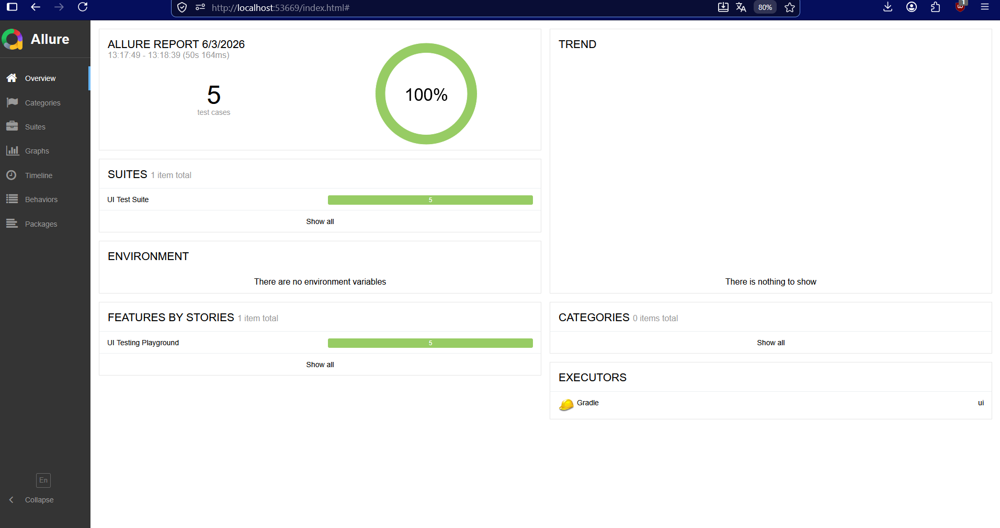

# UI Tests

## Что проверяется

- `DynamicIdTest` - клик по кнопке с динамическим ID
- `FramesTest` - чтение текста внутри iframe
- `SampleAppTest` - логин с валидными данными
- `TextInputTest` - изменение текста кнопки через поле ввода
- `VisibilityTest` - скрытие элементов после нажатия `Hide`

## Как запускать

### Запуск всех тестов

```bash
.\gradlew clean test
````

### Запуск отчета Allure

```bash
.\gradlew allureServe
```

Отчет будет доступен на localhost:[randomPort]


### Запуск в нужном браузере

Firefox:

```bash
.\gradlew clean test -Dbrowser=firefox
```

Chrome:

```bash
.\gradlew clean test -Dbrowser=chrome
```

Edge:

```bash
.\gradlew clean test -Dbrowser=edge
```

## По умолчанию

Если `browser` не указан, используется `firefox`.
